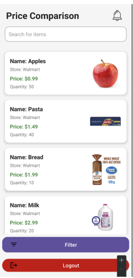
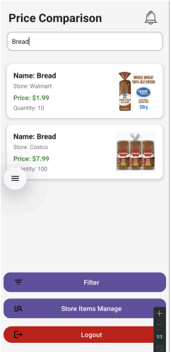
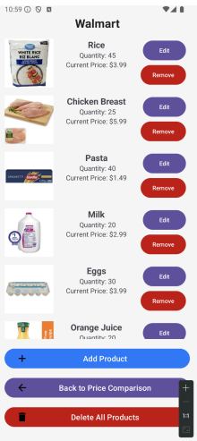
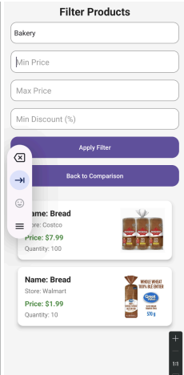
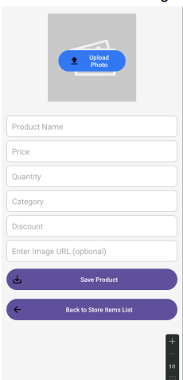

# Kelowna Grocery Deals Finder App  

### Overview  
The Kelowna Grocery Deals Finder App is an Android application designed to help users find the best deals on groceries by comparing prices across various stores. Built using **Android Studio** and **Java**, this app provides a user-friendly interface for budget-conscious individuals, senior citizens, and store managers, ensuring efficiency, ease of use, and financial savings.  

---

### Features  
- **Efficient Deal Finder**  
  - Users can input their shopping list in under 2-3 minutes.  
  - The app returns deal results from all connected stores in less than 15 seconds.  

- **Ease of Interaction**  
  - Users can input and retrieve deals in 3 or fewer visible steps.  
  - Error prevention alerts for unrecognized items with easy editing (2 steps max).  

- **User-Centric Experience**  
  - Intuitive and enjoyable interface, requiring no tutorials for first-time users.  
  - Provides financial rewards by helping users save money on groceries.  

---

### User Profiles  
#### **Primary Users**  
1. **Budget-Conscious Students**  
   - Age: 18-25  
   - Location: Urban/Campus areas in Canada  
   - Income: $8,000-$15,000 annually  
   - Goal: Maximize savings while managing tight budgets.  

2. **Senior Citizens (Retired)**  
   - Age: 65-80  
   - Location: Suburban/Rural areas in Canada  
   - Income: $20,000-$40,000 annually  
   - Goal: Save on groceries with a simple and accessible interface.  

#### **Secondary Users**  
3. **Store Managers**  
   - Age: 30-50  
   - Income: $45,000-$70,000 annually  
   - Goal: Update inventory and pricing to reflect market competitiveness.  

4. **App Developers**  
   - Maintain app performance and usability.  
   - Implement updates and resolve bugs based on user feedback.  

5. **Market Researchers**  
   - Analyze shopping patterns and user trends using app-generated data.  

---

### Usability Goals and Criteria  
1. **Efficiency**  
   - Input shopping list in under 2-3 minutes.  
   - Retrieve deal results in under 15 seconds.  

2. **Ease of Learning and Interaction**  
   - Complete tasks without requiring tutorials.  
   - No more than 3 visible steps to input and retrieve deals.  

3. **Error Prevention and Recovery**  
   - Alerts for invalid/unknown items with easy editing options (max 2 steps).  

4. **User Experience**  
   - Provide an enjoyable, intuitive, and rewarding experience.  
   - Help users save money and feel accomplished.  

---

### Requirement-Gathering Technique  
**Semi-Structured Interviews**  
- Used to understand user needs, challenges, and preferences.  
- Enables targeted and consistent data collection across diverse user groups.  

**Categorized Feedback**  
1. **Functional Requirements**  
   - Real-time/weekly price comparison updates.  
   - Search functionality across multiple stores.  
   - Filter items by price range or discount percentage.  

2. **Data Requirements**  
   - Clear price details, product brand, and location.  
   - Weekly notifications for the best deals.  

3. **Environment Requirements**  
   - Accessibility for senior citizens and local stores.  
   - Students prefer online shopping options for better deals.  

4. **Usability Requirements**  
   - Simple interface for senior citizens.  
   - Advanced filters for students.  
   - Tutorials for less tech-savvy users.  

---

### Technologies Used  
- **Android Studio**: Development environment.  
- **Java**: Programming language.  

---

## Price Comparision Page (User View)

## Price Comparision Page (Store Manager View)

## Item Manage Page (Store Manager View)

## Filter Items Page

## Item Add Page (Store Manager View)

## App Tutorial

